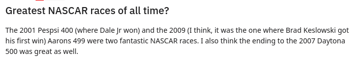

# RaceReview

https://racereviewmsa.azurewebsites.net/ is a sample site designed for users to submit reviews and ratings of past motor races such as Formula 1.
It is aimed to answer the commonly asked question of which past races to watch, so that other users can find races and their reviews and decide to watch or not.

  
  
  
  
  
  
  
  
  

The frontend Typescript React web app connects to a REST API which is a ASP.NET Core Web Application, both of which are hosted as Azure web apps.

The server uses the Entity Framework to connect to an instance of Azure SQL database in a serverless configuration.

Current functionality listed below.

There is a desktop view and a mobile view where the tackbar collapses to a drawer.
  
  

The theme of the site is inspired by chicanes in racing circuits.

Without logging in, users can see the list of races and see its details and also its average score and total number of reviews. 
  

Clicking on a race's page will show user reviews and their scores for that race, which can be upvoted or downvoted.
  

Users can search for races such as the race name and location or sort them by criteria such as the average score.
  

Currently to login there is no backend authentication for logging in, so any username and password is accepted.

Once logged in, the user can add races to the database.

  

Logged in users can submit or edit or delete their reviews and scores for the races.
  

Once a review is submitted, the average score and total number of reviews will update.
  

Logging in as 'Admin' with 'password' as the password, gives full admin privileges, and can edit/delete races or other user's reviews.

In Chrome only, for the review it uses the Web Speech API, so the user's voice input can be converted to text in the review box.
It will listen for several spoken sentences.

  

In the chat tab, logged in users can live chat to each other.
The chat service is run as a Azure Function app which then connects to an instance of Azure SignalR service.
  
  

Backend code is at https://github.com/GeorgeCLu/MSA_Race_Review_API

Backend with Swagger ui interface web link: https://msaracereviewapi.azurewebsites.net/index.html

SignalR chat code is at https://github.com/GeorgeCLu/racereviewchatsignalr
